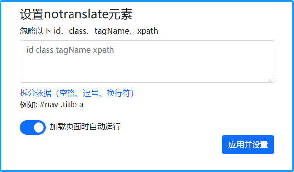

# Edge-Extensions

## [translation-extensions](https://microsoftedge.microsoft.com/addons/detail/%E7%BF%BB%E8%AF%91%E8%AE%BE%E7%BD%AE/kfgcdfhmodedolojlfmnpkdlnaaboiee)

* Source content: Open the `Index.razor` file in the `Pages` folder and code something.
* Predicted content: Open the __*Index.razor*__ file in the __*Pages*__ folder and code something.

When we use the browser's translation function, the outcome is not always as predicted. To correct this, we install the __translation-extensions__ plugin and make sure it __runs automatically when the page loads__. After refreshing the page, we can use the browser's translation function again.

You can also add any html elements to the setting input then click the __Apply&Set__ button achieve the same effect

